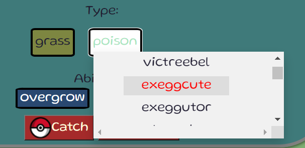

# Pokedex Task
# Rama's solution
-----
The solution is in the solution folder. Written using

* HTML
* JS - with axios.
* CSS
---- 

----

### Getting started:
----
#### Installation
* Clone this repo! - https://github.com/ramabadash/pokedex/tree/rama's-pok%C3%A9dex

* My GitHub page - 

---
### Page Structure
---
* **User name** - you can chose your user name and catch pokemons!
* **Search bars** - You can search for your favorite Pokemon with a name or ID!
* **Search button** 
* **Next and Previus buttons** 
* **My collection button** - show youre personal collection.
* **Poke card**- With : Image, Name, Height, Weight, Type, Ability, catch & release buttons.

---- 
### Interaction
---
* **User name** - To use the site you need to choose a username for the game. To save it, click save. If you want to change it click on change.
* **Search** - You can search for your favorite Pokemon with a name or ID! To search for it, click on the search button or the "Enter" key.
* **Switch between Pokemon** - You can press the "forward" and "backward" buttons to easily skip between Pokemon.
* **Collection** - Clicking a button will display the user's Pokemon collection. You can click on the name of the Pokemon and it will be displayed in the central area.

* **Type Names** - By clicking on the type of Pokemon you can see a list of names of other Pokemon with the same type. Another click will close the list.
* **Names list** - If you want to go to one of the Pokemon from the list of names you can click on it and it will be shown to you on the card.

* **Error massege** - If you entered an incorrect name or ID to worry, you will be presented with a custom message and you can try again.

* **Sucsses massege** - If you were able to catch or release a Pokemon a message will be displayed accordingly.

* **Back picture** - Going over the Pokemon image will show you an image from behind. When you leave the image will change back.

* **Type background** - Each type of color has its own custom background.
* **Loader** - Pokémon loader rotating!

* **Defult card** - 

---
### Thanks
---
* **Poke API** - https://pokeapi.co/

